# Отчет по практической работе №1
## Студент: [ПАВ]
## Группа: [БСБО-16-23]
## Дата выполнения: [28.02.2026]
### 1. Выполненные команды Docker
#### 1.1 Работа с образами
\`\`\`
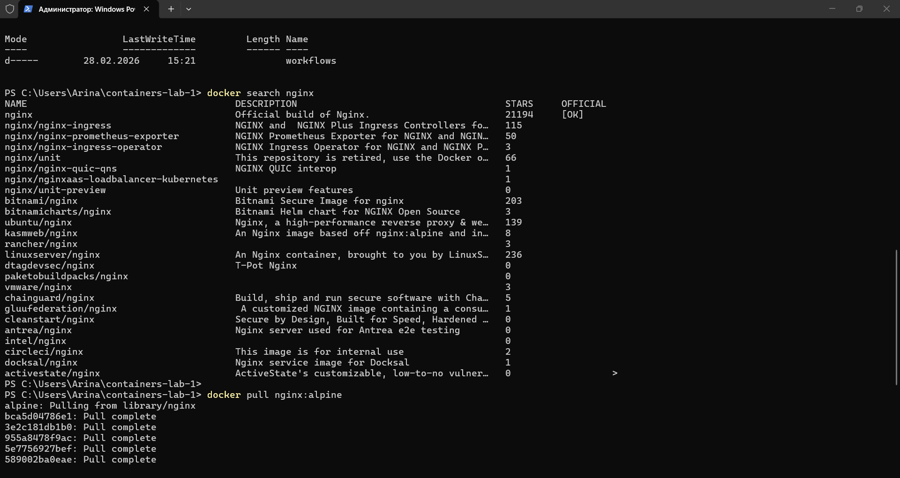
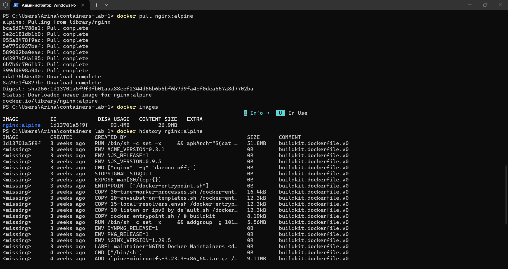
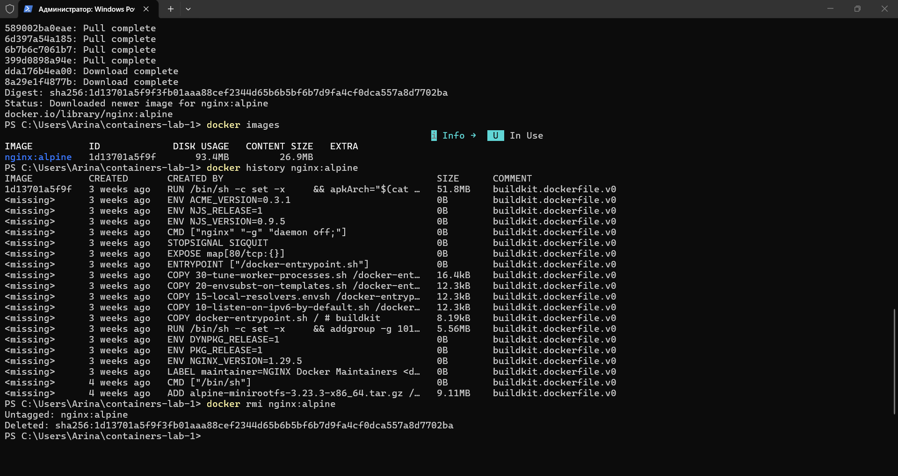
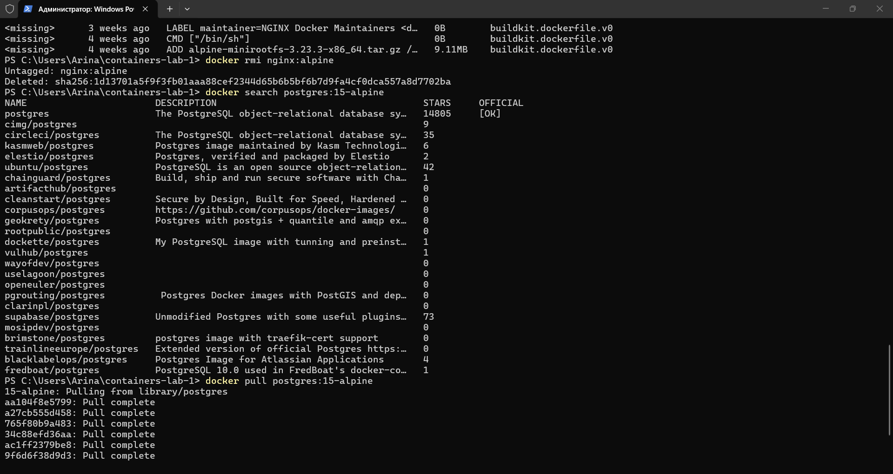
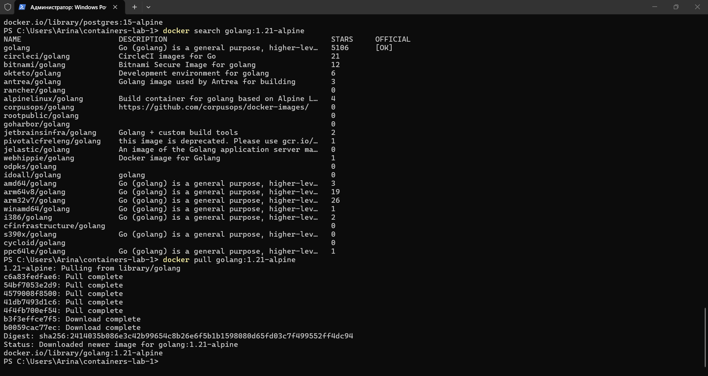
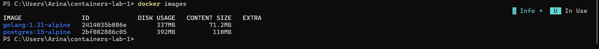
\`\`\`
#### 1.2 Работа с контейнерами
\`\`\`
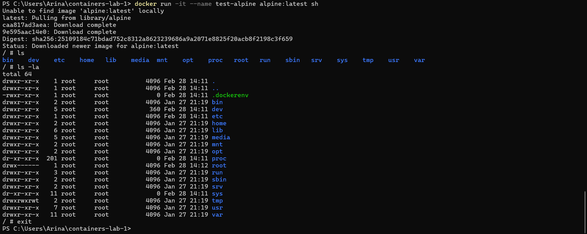
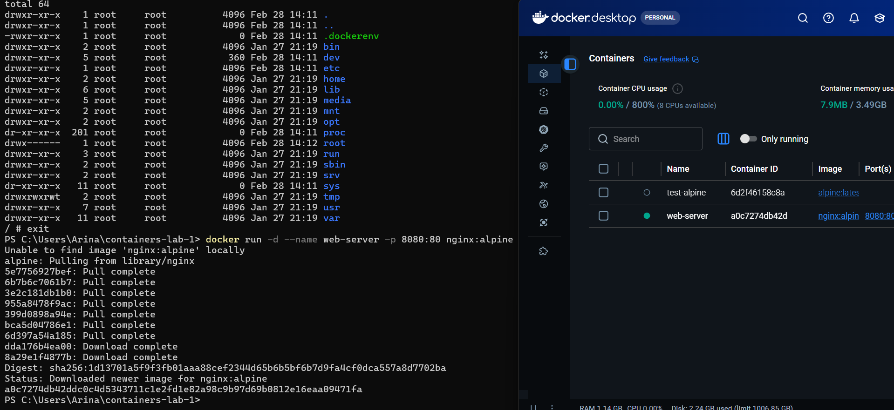
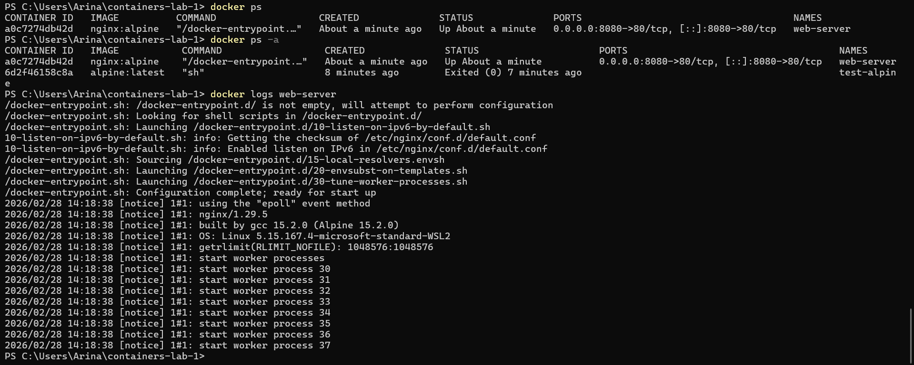
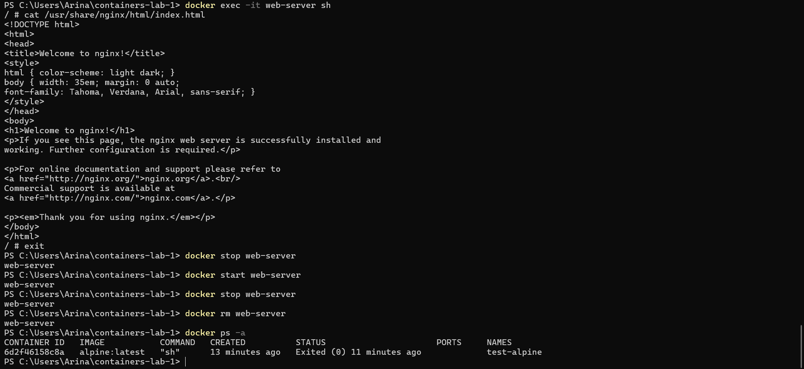
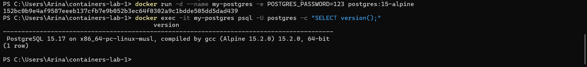
\`\`\`
#### 1.3 Работа с томами
\`\`\`
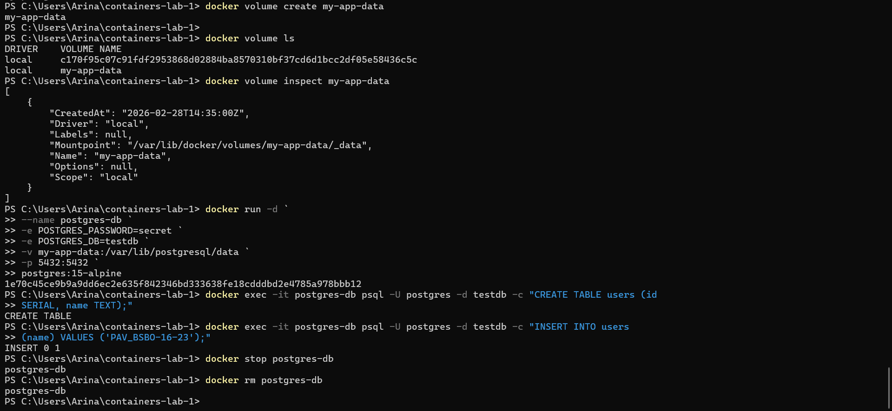
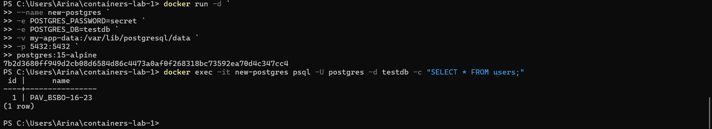
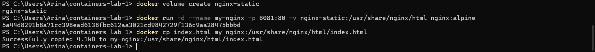
\`\`\`
### 2. Скриншоты работающего приложения
#### 2.1 Главная страница
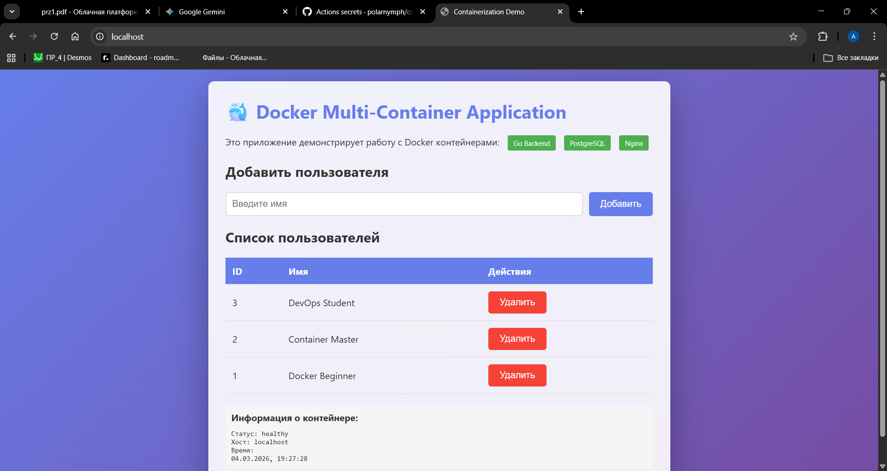
#### 2.2 Добавление пользователя
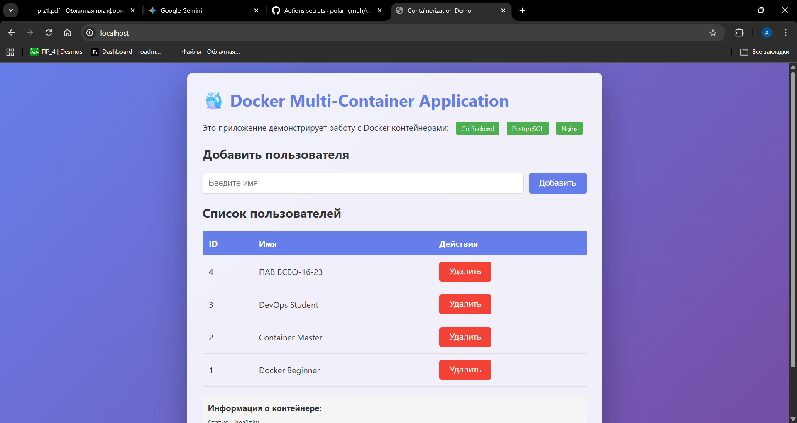
#### 2.3 Список пользователей в БД
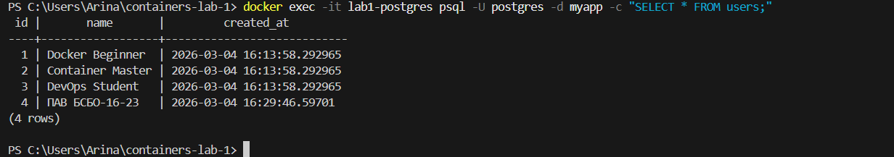
### 3. GitHub Actions
#### 3.1 Успешный запуск workflow
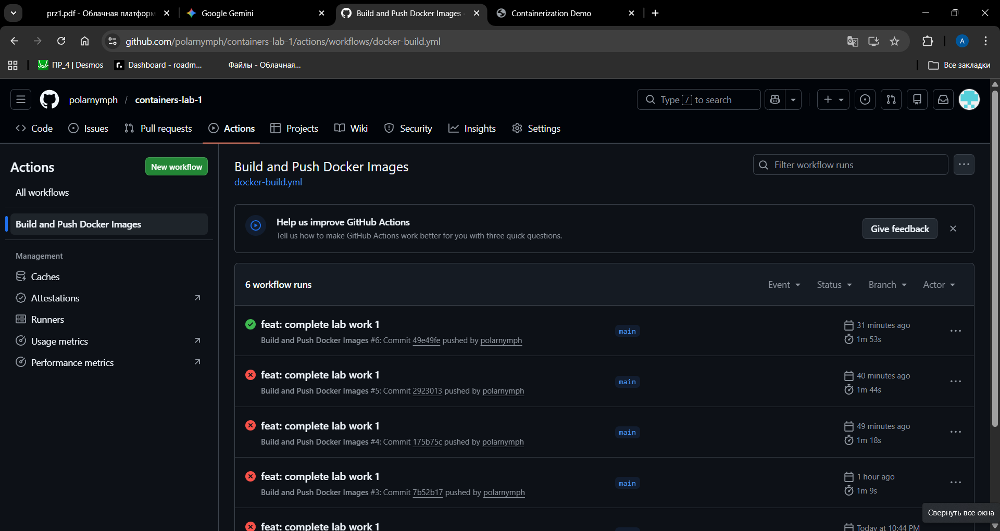
#### 3.2 Опубликованные образы в GHCR

### 4. Выводы
[Опишите, что нового узнали, с какими трудностями столкнулись]
